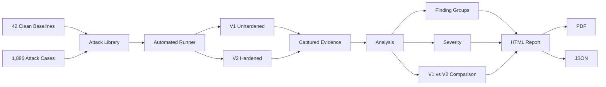

# RED LAB — Adversarial Testing Redefined

**Team Checkmate's automated adversarial red-teaming toolkit for deployed AI inference endpoints.**

[](https://ahsan-141117-project-red-lab.hf.space/)
[](https://www.python.org/)
[](https://fastapi.tiangolo.com/)
[](https://www.docker.com/)

> **Live application:** https://ahsan-141117-project-red-lab.hf.space/  
> **Supporting files / submission material:** https://drive.google.com/drive/folders/1gHsV9YVZ7aJrIQTeHOKQeq_nqM8JGULM?usp=sharing

---

## Overview

RED LAB tests how a deployed AI endpoint behaves when its inputs are malformed, adversarial, ambiguous, unusually large, or deliberately perturbed.

Instead of evaluating only the model in isolation, RED LAB exercises the **served API and the model together**.

The system deploys the same pinned text-classification model behind two endpoints:

- **V1 — Unhardened:** baseline FastAPI deployment.
- **V2 — Hardened:** the identical model with application-layer defenses added.

The same benchmark is run against both versions. This lets us measure what was actually improved by endpoint hardening without changing or retraining the underlying model.

RED LAB then produces structured evidence including:

- HTTP responses and errors
- latency
- prediction changes
- confidence changes
- probability-distribution drift
- finding severity
- V1 → V2 comparison
- remediation guidance
- HTML, PDF and JSON reports

---

## Try It Live

### Run Live Demo

The deployed **Live Demo** runs a curated subset of **162 real benchmark cases** against V1 and V2.

It demonstrates two important classes of failure:

1. **Endpoint-level failure** — for example, an oversized request that produces an unhandled HTTP 500 on V1 but is safely rejected by V2.
2. **Prediction instability** — for example, a visually confusable Unicode character that changes the model's top prediction while the API still returns HTTP 200.

### Try Your Own Input

The **Live Red-Team Lab** allows a visitor to enter a sentence.

RED LAB automatically derives a bounded set of controlled adversarial variants and sends the same variants through V1 and V2.

For each variant, the system compares:

- acceptance / rejection behavior
- top-label changes
- confidence
- full class-probability distribution
- total variation distance
- latency
- whether the weakness was mitigated by V2

Each result is classified as:

- **Mitigated by V2**
- **Persists after hardening**
- **V2 regression**
- **No material effect**
- **Inconclusive**

▶ **Launch RED LAB:**  
https://ahsan-141117-project-red-lab.hf.space/

---

## Benchmark

The complete benchmark contains:

| Component | Count |
|---|---:|
| Clean baselines | 42 |
| Attack cases | 1,886 |
| **Total requests per endpoint** | **1,928** |
| Automatically scored attack cases | 1,718 |
| REVIEW / DIAGNOSTIC attack cases | 168 |

The 42 clean baselines establish each endpoint's reference prediction.

The 1,886 attack cases span six categories:

| Category | Examples |
|---|---|
| Malformed / oversized | Large bodies, malformed requests, unknown fields |
| Boundary & type | Length boundaries, incorrect types |
| Perturbation | Typos, transpositions, deletions, word splitting |
| Encoding | Cyrillic/Greek confusables, fullwidth characters, zero-width characters, bidi |
| Whitespace | Tabs, newlines, Unicode spaces, repeated spacing |
| Truncation | Inputs placing semantic cues near or beyond sequence boundaries |

REVIEW and DIAGNOSTIC cases are retained as evidence but excluded from automatic vulnerability rates where their intended semantics cannot be established reliably.

---

## Results

Across the verified full benchmark:

| Metric | V1 — Unhardened | V2 — Hardened |
|---|---:|---:|
| Unhandled HTTP 5xx responses | **91** | **0** |
| Automatically scored failures | **310 / 1,718** | **113 / 1,718** |
| Observed scored failure rate | **18.0%** | **6.6%** |
| Qualifying prediction flips | **218 / 1,370** | **112 / 1,373** |
| Finding groups | **29** | **14** |
| Critical + High finding groups remaining | **7** | **0** |

**15 of 29 finding groups were resolved with no model retraining.**

The remaining findings are important: application-layer hardening eliminated the observed endpoint failures, but prediction sensitivity to typo-style perturbations and cross-script homoglyphs still remained.

That distinction is intentional. RED LAB does not treat endpoint defenses as proof that the underlying model has become robust.

> These measurements describe this fixed benchmark, model revision and deployment. They should not be interpreted as a general robustness guarantee.

---

## V2 Hardening

V2 adds four application-layer controls while keeping the model unchanged:

1. **Input-length validation** before inference
2. **Strict request schema validation**
3. **Scoped exception handling**
4. **Unicode and whitespace normalization**

Because V1 and V2 use the **same exact pinned model revision**, the experiment isolates the effect of these application-layer defenses.

---

## Architecture



The major pipeline stages are deliberately separated:

```text
Baselines
   ↓
Attack Library
   ↓
Runner
   ↓
V1 / V2
   ↓
Analysis
   ↓
Report
```

A shared contract defines the data exchanged between components.

---

## Model

RED LAB uses:

[`j-hartmann/emotion-english-distilroberta-base`](https://huggingface.co/j-hartmann/emotion-english-distilroberta-base)

The model classifies English text into seven emotions:

- anger
- disgust
- fear
- joy
- neutral
- sadness
- surprise

For reproducibility, the model revision is pinned:

```text
MODEL_REVISION = 0e1cd914e3d46199ed785853e12b57304e04178b
```

Both V1 and V2 load this exact revision.

---

## Repository Structure

```text
contract.py
    Shared experiment data contracts.

endpoint/
    Model loading plus V1 and V2 FastAPI endpoints.

baseline/
    42 clean baseline sentences.

attacks/
    Attack generators, metadata, evidence tiers and manifest generation.

runner/
    Executes the benchmark and records responses, errors, health and latency.

analysis/
    Evaluates attack oracles, prediction drift, severity and V1/V2 comparison.

report/
    Generates technical HTML/PDF/JSON reports.

web/
    Public RED LAB web application and Live Red-Team Lab.

artifacts/
    Preserved verified full-benchmark report and evidence.

tests/
    Unit, integration and browser regression tests.

run_all.py
    Main experiment orchestrator.
```

---

## Running Locally

### Requirements

The release was developed and validated using **Python 3.11**.

Clone the repository:

```bash
git clone https://github.com/AminMaleh03/adversarial-redteam-toolkit-team-checkmate.git
cd adversarial-redteam-toolkit-team-checkmate
```

Create a virtual environment:

### Windows

```powershell
py -3.11 -m venv .venv
.\.venv\Scripts\Activate.ps1
```

### macOS / Linux

```bash
python3.11 -m venv .venv
source .venv/bin/activate
```

Install dependencies:

```bash
pip install -r requirements.txt
```

---

## Run the Web Application

```bash
python -m uvicorn web.app:app --host 127.0.0.1 --port 7860
```

Then open:

```text
http://127.0.0.1:7860/
```

The web application exposes only the public controller on port `7860`.

V1 and V2 are started internally when required and are not intended to be exposed publicly.

---

## Run the Experiment

`run_all.py` is the main experiment entry point.

### Curated demo

```bash
python run_all.py --mode demo
```

The Demo runs the same real pipeline using a curated attack subset suitable for an interactive demonstration.

### Full benchmark

```bash
python run_all.py --mode full
```

Full mode executes:

```text
42 clean baselines
+
1,886 attack cases
=
1,928 requests against V1

and

1,928 requests against V2
```

The pipeline then performs analysis and generates the report.

To run without automatically opening the report:

```bash
python run_all.py --mode demo --no-open
python run_all.py --mode full --no-open
```

---

## Docker

RED LAB is deployed as a Docker application.

Build locally:

```bash
docker build -t red-lab .
```

Run:

```bash
docker run --rm -p 7860:7860 red-lab
```

Then visit:

```text
http://localhost:7860/
```

The deployment architecture exposes only port `7860`; the V1/V2 target processes remain internal to the container.

---

## Testing

Run the complete automated test suite:

```bash
python -m pytest -q
```

The final deployment release was validated with **607 automated tests**, including unit, integration and browser regression coverage.

Release acceptance also covered:

- full application startup
- Live Demo execution
- Custom → Demo → Custom sequential runs
- active-run reattachment
- reload during execution
- browser Back / Forward handling
- report navigation
- mobile/responsive layouts
- Docker execution
- deployed Hugging Face Space behavior

---

## Reports and Evidence

RED LAB produces:

- machine-readable JSON evidence
- short Live Demo reports
- a full technical report
- PDF export
- ranked findings
- remediation recommendations
- explicit denominators
- evidence hashes

The deployed application provides access to the preserved **full technical report** separately from the 162-case Live Demo results.

This distinction is deliberate:

> **Live Demo = interactive subset**  
> **Technical Report = authoritative full 1,928-request benchmark**

---

## Reproducibility

The experiment pins:

- Python/runtime dependencies
- model identifier
- exact model revision
- attack manifest
- baseline set
- analysis rules

The runner records:

- selected and completed case IDs
- suite fingerprints
- manifests
- response bodies
- errors
- latency
- endpoint health

The verified benchmark achieved **1,928 / 1,928 coverage on both V1 and V2**.

---

## Limitations

This prototype evaluates:

- one English text-classification model
- one pinned model revision
- a fixed adversarial benchmark

Most prediction perturbation evidence is mechanically justified rather than manually relabelled sentence-by-sentence.

Latency measurements depend on the execution environment.

The reported results therefore describe this experiment and deployment; they are **not a universal guarantee of AI-model robustness**.

---

## Project Versioning

The deployed product is branded **RED LAB v5.0**.

The repository's **V6 deployment release** refers to the final release/deployment engineering phase. It does not represent a new model, benchmark or analysis methodology.

---

## Team Checkmate

RED LAB was developed by **Team Checkmate**:

- Ahsan
- Rayyan
- Khalid
- Lamei
- Amin

---

## Links

**Live RED LAB**  
https://ahsan-141117-project-red-lab.hf.space/

**GitHub Repository**  
https://github.com/AminMaleh03/adversarial-redteam-toolkit-team-checkmate

**Submission / Supporting Files**  
https://drive.google.com/drive/folders/1gHsV9YVZ7aJrIQTeHOKQeq_nqM8JGULM?usp=sharing

---

**Team Checkmate — RED LAB**  
*Adversarial Testing Redefined*
