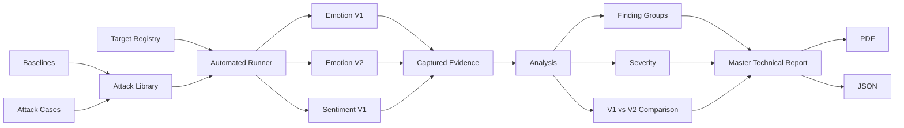

# RED LAB — Adversarial Testing Redefined

**Team Checkmate's automated adversarial red-teaming toolkit for deployed AI inference endpoints.**

**Current release: Red Lab v7** — multi-target evaluation registry, additional out-of-coverage
evaluations, an automated CI release gate, and a dark brand system across the app and the
generated reports.

[](https://ahsan-141117-project-red-lab.hf.space/)
[](https://www.python.org/)
[](https://fastapi.tiangolo.com/)
[](https://www.docker.com/)

> **Live application:** https://ahsan-141117-project-red-lab.hf.space/  
> **Supporting files / submission material:** https://drive.google.com/drive/folders/1gHsV9YVZ7aJrIQTeHOKQeq_nqM8JGULM?usp=sharing

*The Hugging Face Space listing may be set to Protected rather than fully Public. The link above
still works for anyone who has it — Protected only removes the Space from public search and
the unauthenticated Hub API, it does not block the running application.*

---

## Overview

RED LAB tests how a deployed AI endpoint behaves when its inputs are malformed, adversarial,
ambiguous, unusually large, or deliberately perturbed.

Instead of evaluating only the model in isolation, RED LAB exercises the **served API and the
model together**, through a small, model-free **target registry** (`endpoint/targets.json`)
that declares every model, endpoint and evaluation the toolkit knows how to run. Adding a new
target is registry configuration, not a code change to the attack suite, the runner, the
analysis engine or the report generator.

Two independent classification tasks are currently registered:

- **Emotion (7-way)** — the original experiment. The same pinned model is deployed behind two
  endpoints, **V1 (unhardened)** and **V2 (hardened)**, so the same benchmark run against both
  isolates exactly what application-layer hardening changed, without retraining anything.
- **Sentiment (2-way, SST-2)** — a second, independent classification task with a single
  endpoint and **no hardened counterpart by design**. It exists to prove the registry and the
  rest of the pipeline generalize to a target that was never part of the original experiment,
  and its results are never presented as a before/after comparison.

RED LAB produces structured evidence including:

- HTTP responses and errors
- latency
- prediction changes
- confidence changes
- probability-distribution drift
- finding severity
- V1 → V2 comparison (paired evaluations only)
- remediation guidance
- HTML, PDF and JSON reports, including one multi-target **Master Technical Report**

---

## Try It Live

Both the Live Demo and the Live Red-Team Lab let you pick which registered evaluation to run —
the paired emotion journey (V1 vs. V2) or the standalone sentiment journey — from a single
selector; the rest of the experience adapts to whichever one is chosen.

### Run Live Demo

The deployed **Live Demo** runs a curated subset of real benchmark cases against the selected
evaluation's target(s).

For the emotion journey, it demonstrates two important classes of failure:

1. **Endpoint-level failure** — for example, an oversized request that produces an unhandled
   HTTP 500 on V1 but is safely rejected by V2.
2. **Prediction instability** — for example, a visually confusable Unicode character that
   changes the model's top prediction while the API still returns HTTP 200.

### Try Your Own Input

The **Live Red-Team Lab** allows a visitor to enter a sentence.

RED LAB automatically derives a bounded set of controlled adversarial variants and sends them
through the selected target(s).

For each variant, the system compares:

- acceptance / rejection behavior
- top-label changes
- confidence
- full class-probability distribution
- total variation distance
- latency
- whether the weakness was mitigated by V2 (paired evaluations only)

Each result is classified as:

- **Mitigated by V2**
- **Persists after hardening**
- **V2 regression**
- **No material effect**
- **Inconclusive**

(the sentiment journey reports acceptance, label, confidence and distribution shift directly,
without a mitigation verdict, since it has no hardened counterpart to compare against.)

▶ **Launch RED LAB:**  
https://ahsan-141117-project-red-lab.hf.space/

---

## Evaluation Registry

Every evaluation RED LAB knows how to run is declared once, by identity, in
`endpoint/targets.json`. Five evaluation identities are registered:

| Evaluation ID | Kind | Target(s) | Suite | Purpose |
|---|---|---|---|---|
| `emotion.core` | Paired | `emotion_v1`, `emotion_v2` | `core` — 1,928 cases | The original V1/V2 hardening comparison |
| `emotion.oces` | Paired | `emotion_v1`, `emotion_v2` | `oces` — 63 cases | Additional paraphrase/distractor cases, authored *after* the defenses were frozen |
| `sentiment.core` | Single | `sentiment_v1` | `core` — 1,931 cases | Standalone sentiment robustness; no hardened counterpart |
| `sentiment.oces` | Single | `sentiment_v1` | `oces` | Additional sentiment paraphrase/distractor cases |
| `ci.emotion` | Single (CI) | `emotion_v2` | frozen selection `ci_core_v1` — 162 cases | Automated release gate: candidate vs. a frozen reference |

A paired evaluation's `comparison` is a real before/after verdict. A single-target
evaluation's `comparison` is explicitly `null` in its analysis document — the toolkit never
invents a comparison where there is nothing to compare against.

**OCES** (the additional-evaluation suites) are paraphrase and distractor cases the team wrote
*after* V2's four defenses were already frozen, precisely so the extra evidence cannot have
been shaped by already knowing what would pass.

---

## Benchmark

### Emotion — core suite

| Component | Count |
|---|---:|
| Clean baselines | 42 |
| Attack cases | 1,886 |
| **Total requests per endpoint** | **1,928** |
| Automatically scored attack cases | 1,718 |
| REVIEW / DIAGNOSTIC attack cases | 168 |

The attack cases span six categories:

| Category | Examples |
|---|---|
| Malformed / oversized | Large bodies, malformed requests, unknown fields |
| Boundary & type | Length boundaries, incorrect types |
| Perturbation | Typos, transpositions, deletions, word splitting |
| Encoding | Cyrillic/Greek confusables, fullwidth characters, zero-width characters, bidi |
| Whitespace | Tabs, newlines, Unicode spaces, repeated spacing |
| Truncation | Inputs placing semantic cues near or beyond sequence boundaries |

REVIEW and DIAGNOSTIC cases are retained as evidence but excluded from automatic vulnerability
rates where their intended semantics cannot be established reliably.

### Sentiment — core suite

1,931 requests against the single sentiment endpoint (a materially different case count and
composition from the emotion suite — never presented as the emotion total).

### Additional evaluations (OCES)

| Evaluation | Planned cases (per endpoint) | Composition |
|---|---:|---|
| `emotion.oces` | 63 | 21 seed baselines + 21 `oces.paraphrase` + 21 `oces.distractor` |
| `sentiment.oces` | — | Sentiment-specific paraphrase/distractor seed set |

---

## Results

### Emotion — V1 vs. V2 (core suite)

| Metric | V1 — Unhardened | V2 — Hardened |
|---|---:|---:|
| Unhandled HTTP 5xx responses | **91** | **0** |
| Automatically scored failures | **310 / 1,718** | **113 / 1,718** |
| Observed scored failure rate | **18.0%** | **6.6%** |
| Qualifying prediction flips | **218 / 1,370** | **112 / 1,373** |
| Finding groups | **29** | **14** |
| Critical + High finding groups remaining | **7** | **0** |

**15 of 29 finding groups were resolved with no model retraining.**

The remaining findings are important: application-layer hardening eliminated the observed
endpoint failures, but prediction sensitivity to typo-style perturbations and cross-script
homoglyphs still remained.

That distinction is intentional. RED LAB does not treat endpoint defenses as proof that the
underlying model has become robust.

### Sentiment — core suite (single target, no comparison)

| Metric | sentiment_v1 |
|---|---:|
| Coverage | 1,931 / 1,931 (100%) |
| Unhandled HTTP 5xx responses | **85** |
| Timeouts | 1 |
| Eligible drift comparisons | 1,604 |
| Qualifying prediction flips | 99 (6.17%) |
| Finding groups | 18 |

### Additional evaluations (OCES) — no findings on the frozen defenses

| Evaluation | Eligible comparisons | Qualifying flips | Finding groups | 5xx / timeouts |
|---|---:|---:|---:|---:|
| `emotion.oces` (both endpoints) | 18 | 0 | 0 | 0 |
| `sentiment.oces` | 28 | 2 | 2 | 0 |

> These measurements describe this fixed benchmark, these model revisions and this
> deployment. They should not be interpreted as a general robustness guarantee.

---

## V2 Hardening (Emotion Target Only)

V2 adds four application-layer controls while keeping the model unchanged:

1. **Input-length validation** before inference
2. **Strict request schema validation**
3. **Scoped exception handling**
4. **Unicode and whitespace normalization**

Because emotion V1 and V2 use the **same exact pinned model revision**, the experiment
isolates the effect of these application-layer defenses. Sentiment has **no V2** — that
absence is deliberate, not a gap, and its results are never framed as a before/after story.

---

## Automated CI Release Gate

`ci.emotion` turns one real evaluation into a pass/fail decision usable by CI:

- `runner/gate.py` runs the actual orchestrator against `emotion_v2` (the candidate) and a
  frozen 162-case selection (`analysis/case_sets/ci_core_v1.json`) with a frozen reference and
  policy (`analysis/policies/ci_core_v1.json`).
- The decision logic lives entirely in `analysis/policy.py`, kept separate from the gate
  runner itself — a policy that cannot be loaded, or an evaluation that could not run,
  produces an execution error, never a silent pass and never a silent fail.
- A GitHub Actions workflow (`.github/workflows/release-gate.yml`) runs this same gate on
  every push, verifies the candidate's commit and model identity, uploads the evidence even on
  a failing policy, and only permits a Hugging Face deployment after a real pass on a
  published release.
- Real local reproduction: 13/13 checks, exit code 0 (`artifacts/ci_gate_evidence_v1/`).

---

## Architecture



The major pipeline stages are deliberately separated:

```text
Target Registry (endpoint/targets.json)
   ↓
Baselines
   ↓
Attack Library
   ↓
Runner
   ↓
V1 / V2 (or single target)
   ↓
Analysis
   ↓
Report
```

A shared contract (`contract.py`) defines the data exchanged between components, including the
model-free registry types every component reads instead of duplicating target configuration.

---

## Models

RED LAB currently evaluates two independently trained, unmodified public models:

| Task | Model | Revision | Labels |
|---|---|---|---|
| Emotion (7-way) | [`j-hartmann/emotion-english-distilroberta-base`](https://huggingface.co/j-hartmann/emotion-english-distilroberta-base) | `0e1cd914e3d46199ed785853e12b57304e04178b` | anger, disgust, fear, joy, neutral, sadness, surprise |
| Sentiment (2-way, SST-2) | [`distilbert/distilbert-base-uncased-finetuned-sst-2-english`](https://huggingface.co/distilbert/distilbert-base-uncased-finetuned-sst-2-english) | `714eb0fa89d2f80546fda750413ed43d93601a13` | NEGATIVE, POSITIVE |

Revisions are pinned exactly so every endpoint, every teammate's cache, and the CI gate resolve
to identical weights regardless of what each model's `main` branch points to later. Neither
model is fine-tuned or modified in any way — both are evaluated exactly as published.

---

## Repository Structure

```text
contract.py
    Shared experiment data contracts, including the model-free target/evaluation types.

endpoint/
    Model loading, V1/V2 (and single-target) FastAPI endpoints, and targets.json — the
    static registry of every model, endpoint and evaluation identity.

baseline/
    Clean baseline sentences for each registered task (emotion and sentiment).

attacks/
    Attack generators, metadata, evidence tiers, coverage map and manifest generation.

runner/
    Executes the benchmark and records responses, errors, health and latency;
    gate.py runs the automated CI release-gate evaluation.

analysis/
    Evaluates attack oracles, prediction drift, severity and V1/V2 comparison;
    policy.py holds the pure pass/fail decision logic for the CI gate;
    case_sets/ and policies/ hold the frozen CI selection and policy.

report/
    Generates technical HTML/PDF/JSON reports, including master_report.py — the
    multi-target Master Technical Report covering all five evaluation identities.

web/
    Public RED LAB web application, the Live Red-Team Lab, and the target-aware
    progress/status layer shared by both.

artifacts/
    Preserved verified benchmark reports and evidence for every evaluation identity.

tests/
    Unit, integration and browser regression tests.

docs/stage3/
    Planning documents, decisions and per-member task records for the registry/
    multi-target/CI-gate work.

run_all.py
    Main experiment orchestrator; resolves a requested evaluation against the
    registry and drives the runner, analysis and report stages for it.
```

---

## Running Locally

### Requirements

The release was developed and validated using **Python 3.11**.

Clone the repository:

```bash
git clone https://github.com/AminMaleh03/adversarial-redteam-toolkit-team-checkmate.git
cd adversarial-redteam-toolkit-team-checkmate
```

Create a virtual environment:

### Windows

```powershell
py -3.11 -m venv .venv
.\.venv\Scripts\Activate.ps1
```

### macOS / Linux

```bash
python3.11 -m venv .venv
source .venv/bin/activate
```

Install dependencies:

```bash
pip install -r requirements.txt
```

---

## Run the Web Application

```bash
python -m uvicorn web.app:app --host 127.0.0.1 --port 7860
```

Then open:

```text
http://127.0.0.1:7860/
```

The web application exposes only the public controller on port `7860`. V1, V2 and the
sentiment target are started internally when required and are not intended to be exposed
publicly.

---

## Run the Experiment

`run_all.py` is the main experiment entry point.

### Curated demo (default emotion journey)

```bash
python run_all.py --mode demo
```

The Demo runs the same real pipeline using a curated attack subset suitable for an interactive
demonstration.

### Full benchmark

```bash
python run_all.py --mode full
```

Full mode against the default emotion evaluation executes:

```text
42 clean baselines
+
1,886 attack cases
=
1,928 requests against V1

and

1,928 requests against V2
```

### Running a specific registered evaluation

```bash
python run_all.py --mode full --evaluation sentiment.core --html-only
python run_all.py --mode full --evaluation emotion.oces --html-only
```

The pipeline resolves the evaluation from `endpoint/targets.json`, then runs the same
runner/analysis/report stages against whichever target(s) it names.

To run without automatically opening the report:

```bash
python run_all.py --mode demo --no-open
python run_all.py --mode full --no-open
```

---

## Docker

RED LAB is deployed as a Docker application.

Build locally:

```bash
docker build -t red-lab .
```

Run:

```bash
docker run --rm -p 7860:7860 red-lab
```

Then visit:

```text
http://localhost:7860/
```

The deployment architecture exposes only port `7860`; the V1/V2/sentiment target processes
remain internal to the container. The Dockerfile pre-caches every model/tokenizer pair listed
in `endpoint/targets.json` at its exact pinned revision, so the first live run pays no cold
download.

---

## Testing

Run the complete automated test suite:

```bash
python -m pytest -q
```

The v7 release runs **1,134 automated tests (27 skipped)** — unit, integration and browser
regression coverage across the registry, runner, analysis, CI gate and web layers.

Release acceptance also covered:

- full application startup
- Live Demo execution across both the paired emotion and single-target sentiment journeys
- Custom → Demo → Custom sequential runs
- active-run reattachment
- reload during execution
- browser Back / Forward handling
- report navigation, including the multi-target Master Technical Report
- mobile/responsive layouts
- static-asset cache invalidation across releases
- a real, passing local reproduction of the automated CI release gate
- Docker execution
- deployed Hugging Face Space behavior

---

## Reports and Evidence

RED LAB produces:

- machine-readable JSON evidence
- short Live Demo reports
- a full **Master Technical Report** covering all five evaluation identities in one
  navigable document, with independent sections per evaluation
- PDF export
- ranked findings
- remediation recommendations
- explicit denominators
- evidence hashes, re-verified against the recorded bytes before every report render

The deployed application provides access to the preserved **full technical report** separately
from the curated Live Demo results.

This distinction is deliberate:

> **Live Demo = interactive subset**  
> **Master Technical Report = authoritative full evidence across every registered evaluation**

---

## Reproducibility

The experiment pins:

- Python/runtime dependencies
- every model's identifier and exact revision (`endpoint/targets.json`)
- attack manifests
- baseline sets
- analysis rules
- the frozen CI selection and policy

The runner records:

- selected and completed case IDs
- suite fingerprints
- manifests
- response bodies
- errors
- latency
- endpoint health
- registry identity (which target, task and model produced each result)

The verified emotion benchmark achieved **1,928 / 1,928 coverage on both V1 and V2**; the
sentiment benchmark achieved **1,931 / 1,931 coverage** on its single target.

---

## Limitations

This prototype evaluates:

- two English text-classification models (one 7-way emotion model, one 2-way sentiment model)
- one pinned revision of each
- fixed adversarial benchmarks

Most prediction perturbation evidence is mechanically justified rather than manually
relabelled sentence-by-sentence.

Latency measurements depend on the execution environment.

The reported results therefore describe these experiments and this deployment; they are
**not a universal guarantee of AI-model robustness**.

---

## Version History

| Version | What changed |
|---|---|
| V1 – V4 | Core pipeline: baseline generation, attack library, runner, analysis, report, initial web deployment |
| V5.x | Visual design passes (branding through final tuning) |
| V6 | Deployment release: report-navigation fixes, byte-exact Hugging Face Space deployment |
| **V7 (current)** | Model-free target/evaluation registry (emotion + sentiment), OCES additional evaluations, automated CI release gate, multi-target Master Technical Report, dark brand system across the app and generated reports |

---

## Team Checkmate

RED LAB is developed by **Team Checkmate**. The v7 release was built by:

- **Ahsan** — product integration, web application, deployment, reporting
- **Rayyan** — endpoint and runner
- **Khalid** — analysis and the CI release-gate policy
- **Lamei** — attack library and baselines

Earlier phases of the project were also built with **Amin**, whose runner ownership has since
transferred to Rayyan.

---

## Links

**Live RED LAB**  
https://ahsan-141117-project-red-lab.hf.space/

**GitHub Repository**  
https://github.com/AminMaleh03/adversarial-redteam-toolkit-team-checkmate

**Submission / Supporting Files**  
https://drive.google.com/drive/folders/1gHsV9YVZ7aJrIQTeHOKQeq_nqM8JGULM?usp=sharing

---

**Team Checkmate — RED LAB**  
*Adversarial Testing Redefined*
